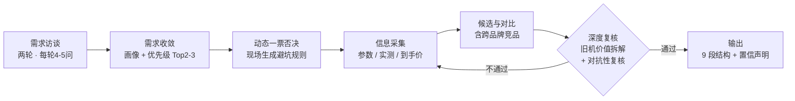

<div align="center">


# phone-buying-guide

**提问式手机选购顾问 · Interview-driven Smartphone Buying Advisor**

[](#-设计哲学零机型数据) [](LICENSE) [](#-安装opensquilla) [](SKILL.md) [](#-设计哲学零机型数据)

*像懂行的朋友一样帮你选手机：先问清"人和钱"，再联网查证，最后给能直接下单的结论。*

</div>

---

## ✨ 核心特性

| | 特性 | 说明 |
|---|---|---|
| 🗣️ | **提问式访谈** | 两轮收敛（摸底 → 按需追问），一轮只问 4-5 个，自适应问法：小白听"高画质卡不卡"，懂行聊芯片传感器 |
| ⚖️ | **动态一票否决** | 避坑规则不写死，按本次访谈现场生成：预算 vs 需求错位、战 N 年的性能冗余、轻薄 vs 配置冲突…… |
| 🔬 | **组件级特长研究** | 收音/麦克风、扬声器、影像传感器这类**营销页不写的组件级能力**，查官网规格页 + 拆解/单项实测——旧机的隐藏强项（例如收音导入专业软件后达到千元级麦克风水准）直接决定它是"淘汰"还是"改役留用" |
| 🧰 | **特殊用途评估** | 备用工作机、直播设备、老人机、车载、监控、遥控器……独特用途单独进访谈题库和能力清单，不会被通用参数表淹没 |
| 💰 | **旧机价值拆解（残值不等式）** | 二手残值 vs 旧机仍可用能力的替代成本，两个数分开算；结论只有三种：淘汰 / 改役留用 / 以旧换新，各带账本 |
| 📉 | **倒退检查** | 新机相对旧机逐维度"持平或更强"，隐性回退（换大电池但充电更慢、砍耳机孔、变重、系统更新年限缩短）强制摆上台面 |
| 🌐 | **信息源地图** | 参数（中关村在线 → 官网规格页）、实测表现（评测数据库，跑分≠体验）、多渠道到手价（京东/拼多多/天猫 + 国补 + 历史价防假促销）、口碑交叉验证 |
| 🛡️ | **数据置信声明** | 信息日期 + 来源强制标注；联网降级时附"未完成检查清单"和用户自助核验路径，禁止假装查过 |

## 🔄 工作流程



访谈把"人"问清楚（性别/年龄段只做侧重不做刻板印象、参数熟悉度决定问法、旧机的"挺好用"必须挖到具体参数）；复核把"数据"反复过堂（需求重叠检查、漏配检查、抬杠检查、倒退检查），两道闸门缺一不可。

## 📋 对比维度（旧机必须在列）

> 价格 | 处理器 | 屏幕 | 影像 | **电池容量 / 充电功率（分开列）** | 重量手感 | **系统更新年限** | 防水等级 | 特色功能 | 与用户需求的匹配点

电池容量和充电功率**禁止合并成一栏**——这是"换大电池但充电变慢"这类隐性倒退被忽略的重灾区；系统更新年限对"打算用 N 年"的用户是硬指标，查厂商官方承诺，不凭印象。

## 🧾 输出结构

1. **3 秒结论** — Top 1-3 推荐 + 一句话理由
2. **需求画像** — 复述确认，防理解跑偏
3. **对比表** — 核心参数 + 实时到手价区间
4. **升级 vs 倒退一页账** — 重点修了什么、隐性代价是什么
5. **最终建议** — 选它为什么、放弃别的为什么
6. **避坑提醒** — 本次动态生成的否决项
7. **渠道与时机** — 在哪买、现在买还是等节点
8. **旧机处置** — 残值 vs 替代成本的账面
9. **数据置信声明** — 日期、来源、未完成检查清单

## 🏗️ 设计哲学：零机型数据

**SKILL.md 只沉淀方法论，不包含任何机型、参数、价格数据。**

- 所有机型事实现场联网采集，训练记忆和历史快照只能做交叉参照
- 有价值的行情快照外部化到带日期的笔记文件，标注"使用前必须复核"
- 因此：**新手机发布，这个 skill 一个字都不用改**——它教的是"怎么研究"，而不是"记住哪些手机"

## 🌐 信息源地图

| 查什么 | 去哪查 |
|---|---|
| 参数 / 配置 / 上市时间 | 中关村在线产品库 → 品牌官网规格页 → 百科兜底 |
| 性能档位 | 最新处理器天梯图 |
| 实测表现 | 知名评测数据库与实机测评（帧率/发热/续航/扬声器） |
| 当前价格 | 京东自营 → 拼多多百亿补贴 → 天猫/官网，报"到手价"（标价 − 国补 − 以旧换新 − 券） |
| 历史价格 | 比价工具识别"先涨后降"假促销 |
| 口碑 / 坑点 | 知乎 / 酷安 / B站交叉验证；信号问题按"城市 + 运营商"查当地实测 |
| 新机节奏 | 官网 + 数码新闻，判断"现在买 / 等大促 / 等换代" |

内置**搜索故障降级链路**（多引擎直连 → 搜索页快照抓取），含快照采信规则：单源低置信、必须型号+存储版本对齐、关键价格双查询互证、未完成的复核必须明示。

## 📦 安装（OpenSquilla）

```bash
# 克隆到工作区 skills 目录
cd <你的工作区>/skills
git clone https://github.com/makefeier/phone-buying-guide.git
```

然后对助手说任意一句即可触发：

> 帮我选手机 / 我想换机 / 手机怎么选

## 💬 快速开始

> **你**：我想买一个手机
>
> **顾问**：先摸个底——男生还是女生？参数熟吗？现在用的什么手机、哪里不满意哪里挺好用？预算多少？最看重啥？
>
> **你**：男生，略懂，现在这台拍视频凑合但续航拉胯……
>
> **顾问**：（第二轮追问后静默查证）3 秒结论：首选 XX——升级/倒退一页账如下，旧机建议以旧换新抵 XXX 元，未核实的渠道价自助验一下……

## 🗺️ Roadmap

- [x] **v1 手机** —— 当前版本
- [ ] v2 耳机（方法论骨架复用，新增访谈题 + 信息源地图）
- [ ] v3 平板 / 笔记本

## License

[MIT](LICENSE) © 2026
